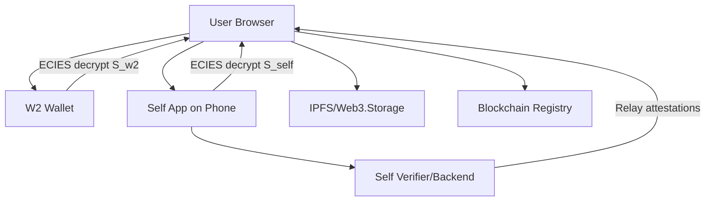

# ReClaim — Wallet Backup & Recovery System

A secure, non-custodial wallet backup and recovery solution that uses cryptographic key splitting between a secondary wallet and Self.xyz identity verification.

## 🎯 Purpose & Goals

- **Non-custodial**: No single party can decrypt user private keys
- **Cryptographically secure**: Uses 2-of-2 key splitting (W2 + Self.xyz)
- **Self-verified**: Self.xyz acts as an active cryptographic gatekeeper
- **Privacy-preserving**: Uses nullifiers instead of direct identity linking

## 📋 Table of Contents

1. [Actors & Terminology](#actors--terminology)
2. [Architecture Overview](#architecture-overview)
3. [Cryptographic Building Blocks](#cryptographic-building-blocks)
4. [Registration Flow](#registration-flow)
5. [Recovery Flow](#recovery-flow)
6. [Self.xyz Integration](#selfxyz-integration)
7. [Data Formats](#data-formats)
8. [Smart Contract Registry](#smart-contract-registry)
9. [Backend API](#backend-api)
10. [Security Model](#security-model)
11. [Developer Checklist](#developer-checklist)

## 👥 Actors & Terminology

### Key Actors

| Actor                 | Description                                                                |
| --------------------- | -------------------------------------------------------------------------- |
| **User**              | Owns primary wallet (W1) and recovery wallet (W2), uses Self app           |
| **Client**            | Browser/desktop app UI that orchestrates encryption and wallet connections |
| **W2 Wallet**         | Recovery wallet (software wallet for demo, real wallet for production)     |
| **Self App**          | User's phone app + Self backend verifier for attestations                  |
| **IPFS/Web3**         | Decentralized storage for encrypted blobs                                  |
| **Registry Contract** | On-chain pointer mapping `primaryAddr → CID`                               |
| **Backend**           | Untrusted relay for Self QR callbacks (cannot decrypt secrets)             |

### Key Terms

| Term              | Description                                                   |
| ----------------- | ------------------------------------------------------------- |
| **Primary (W1)**  | Wallet being backed up (e.g., `0x123...`)                     |
| **Recovery (W2)** | Secondary wallet for recovery (e.g., `0x456...`)              |
| **K**             | Symmetric backup key (32 random bytes)                        |
| **Split Shares**  | `S_w2` and `S_self` where `combine(S_w2, S_self) = K`         |
| **ECIES Package** | `{eph_pub, ciphertext, tag}` encrypted to public key          |
| **Nullifier**     | Self-issued stable identifier for privacy-preserving identity |

### Core Assumptions

- User controls both W1 (at registration) and W2 (at registration & recovery)
- Self provides device public keys via QR/callback model
- Backend is untrusted for secret material — only relays attestations
- For demo: W2 can be software wallet if real wallets don't support ECIES

## 🏗️ Architecture Overview



### Trust Boundaries

| Component    | Trust Level  | Responsibilities                              |
| ------------ | ------------ | --------------------------------------------- |
| **Client**   | ✅ Trusted   | Ephemeral secrets in memory, clears after use |
| **Backend**  | ❌ Untrusted | Relay attestations only, no secret decryption |
| **IPFS**     | ❌ Untrusted | Encrypted storage only, secrets protected     |
| **Registry** | ❌ Untrusted | Public pointers only, no secrets              |

## 🔐 Cryptographic Building Blocks

### 1. Random Symmetric Key (K)

- **Output**: 32 bytes random value
- **Use**: Encrypt W1 private key
- **Implementation**: `enc_priv = AES-256-GCM.encrypt(K, W1_priv_bytes) => {iv, ciphertext, tag}`

### 2. Key Splitting (K → S_w2, S_self)

- **Output**: Two byte arrays of equal length
- **Recombination**: `combine(S_w2, S_self) = K`
- **Method**: XOR split (simple 2-of-2)
  ```javascript
  S_w2 = random(32)
  S_self = K XOR S_w2
  ```

### 3. ECIES Encryption

- **Input**: Recipient public key (secp256k1), plaintext (share)
- **Output**: `ECIESPackage = {eph_pub, ciphertext, tag}`
- **Security**: Only recipient with private key can decrypt

### 4. Self Device Attestation

- **Output**: Signed object containing:
  - `device_pubkey`
  - `nullifier`
  - `timestamp`
  - `signature` by Self verifier
- **Validation**: Client must verify signature and contents

### 5. Blob Binding

- **Purpose**: Prevent replay attacks
- **Implementation**: Attestation must include blob CID or nonce
- **Security**: Prevents reuse of attestations for different blobs

## 📝 Registration Flow

### Prerequisites

- User has W1 private key
- User has access to W2 wallet
- User has Self app installed

### Step-by-Step Process

#### 1. Generate Primary Values

```javascript
K = random(32);
enc_priv = AES256GCM.encrypt(K, W1_priv_bytes);
// → {iv_priv, ciphertext_priv, tag_priv}
```

#### 2. Split Key

```javascript
S_w2 = random(32)
S_self = K XOR S_w2
```

#### 3. W2 Public Key & Encryption

```javascript
// Option A: Signature recovery
sig = W2.sign(message);
pubW2 = recoverPubkey(message, sig);

// Option B: Direct API (preferred)
pubW2 = W2.getPublicKey();

enc_S_w2 = ECIES.encrypt(pubW2, S_w2);
// → {eph_pub_w2, ciphertext_w2, tag_w2}
```

#### 4. Self.xyz QR Flow

```javascript
// Generate registration data
regId = uuid();
nonce_reg = randomNonce();

// QR payload
qrPayload = {
  action: "reclaim-register",
  regId: regId,
  nonce: nonce_reg,
  callback: "https://backend.example.com/self-callback/" + regId,
};

// Display QR and wait for attestation
attestation = waitForAttestation(regId);
```

#### 5. Self Attestation Processing

```javascript
// Verify attestation
verifyAttestationSignature(attestation.attestation_jws);
assert(attestation.nonce === nonce_reg);
assert(attestation.regId === regId);

// Encrypt S_self with device public key
enc_S_self = ECIES.encrypt(attestation.device_pub, S_self);
```

#### 6. Build & Upload Blob

```javascript
blob = {
  primary: primaryAddr,
  enc_priv: enc_priv,
  enc_S_w2: enc_S_w2,
  enc_S_self: enc_S_self,
  self_attestation: attestation,
  meta: {
    created_at: Date.now(),
    version: 1,
  },
};

blobCid = uploadToIPFS(blob);
registry.register(primaryAddr, blobCid);
```

#### 7. Cleanup

```javascript
// Clear all secrets from memory
wipeSecrets(K, S_w2, S_self, W1_priv);
```

## 🔓 Recovery Flow

### Prerequisites

- User knows primary address (W1)
- User has access to W2 wallet
- User has Self app available
- IPFS blob exists and registry maps `primary → CID`

### Step-by-Step Process

#### 1. Fetch Blob

```javascript
blobCid = registry.getCID(primaryAddr);
blobJSON = fetchFromIPFS(blobCid);

// Validate integrity
assert(blobJSON.primary === primaryAddr);
verifyAttestationSignature(blobJSON.self_attestation);
```

#### 2. W2 Unseal

```javascript
// Connect W2 and decrypt share
S_w2 = W2.performECIESDecrypt(blob.enc_S_w2);

// Optional: W2 attestation for audit
nonce_rec = randomNonce();
w2Sig = W2.signMessage(`reclaim:recover:${nonce_rec}:${blobCid}`);
```

#### 3. Self.xyz Unseal

```javascript
// Generate recovery data
recId = uuid();
nonce_self_rec = randomNonce();

// QR payload for recovery
qrPayload = {
  action: "reclaim-recover",
  recId: recId,
  nonce: nonce_self_rec,
  blobCid: blobCid,
  callback: "https://backend.com/self-callback/" + recId,
};

// Wait for Self attestation
attestation = waitForAttestation(recId);

// Verify attestation
verifyAttestationSignature(attestation.attestation_jws);
assert(attestation.nullifier === blob.self_attestation.nullifier);
assert(attestation.blobCid === blobCid);

// Get S_self (either from attestation or request decryption)
S_self = attestation.decryptedShare || requestSelfDecrypt(blob.enc_S_self);
```

#### 4. Combine & Decrypt

```javascript
// Recombine shares
K = combine(S_w2, S_self); // XOR recombination

// Decrypt primary private key
W1_priv = AES256GCM.decrypt(K, blob.enc_priv);
```

#### 5. Post-Recovery Actions

- Import W1_priv into wallet
- Create new W1 and transfer funds (optional)
- Regenerate backup if needed

#### 6. Audit Logging

```javascript
// Emit recovery event
emitRecoveryEvent({
  primaryAddr,
  recTimestamp: Date.now(),
  w2Sig,
  selfAttestationRef: attestation,
});
```

## 🔗 Self.xyz Integration

### Nullifier Handling

**What is a nullifier?**

- Stable identifier returned by Self on each verification
- Represents unique Self identity (privacy-preserving)
- Used to tie registrations and recovery to specific Self account

**Usage:**

- **Registration**: Store nullifier in blob (`blob.self_attestation.nullifier`)
- **Recovery**: Verify `attestation.nullifier === blob.self_attestation.nullifier`

**Security Benefits:**

- Ensures same Self account for registration and recovery
- Prevents cross-account blob decryption
- Binds attestations to specific blobs

### Device Key vs Nullifier

| Component      | Purpose                 | Changes                   |
| -------------- | ----------------------- | ------------------------- |
| **Nullifier**  | Identifies Self account | Stays same across devices |
| **Device Key** | Encrypts S_self share   | Changes with each device  |

**Migration**: When user changes devices, nullifier stays same but device_pub changes.

## 📄 Data Formats

### IPFS Blob Schema

```json
{
  "version": 1,
  "primary": "0x123...",

  "enc_priv": {
    "alg": "AES-256-GCM",
    "iv": "base64(...)",
    "ciphertext": "base64(...)",
    "tag": "base64(...)"
  },

  "enc_S_w2": {
    "alg": "ECIES-secp256k1-AES-256-GCM",
    "eph_pub": "0x02abcd...",
    "ciphertext": "base64(...)",
    "tag": "base64(...)"
  },

  "enc_S_self": {
    "alg": "ECIES-secp256k1-AES-256-GCM",
    "eph_pub": "0x03f001...",
    "ciphertext": "base64(...)",
    "tag": "base64(...)"
  },

  "self_attestation": {
    "nullifier": "nullifier_string",
    "device_pub": "0x03fedc...",
    "attestation_jws": "eyJ...",
    "nonce_reg": "string",
    "timestamp": 1691234567
  },

  "meta": {
    "created_at": 1691234567,
    "kdf": "HKDF-SHA256",
    "split": "xor-2of2",
    "notes": "ReClaim v1"
  }
}
```

### Important Notes

- All binary fields are base64/hex encoded
- `attestation_jws` must be verified client-side using Self's public keys
- Optional: Add `client_signature` for non-repudiation

## 📜 Smart Contract Registry

### Solidity Contract

```solidity
// SPDX-License-Identifier: MIT
pragma solidity ^0.8.17;

contract ReClaimRegistry {
    mapping(address => string) public cidOf;

    event Registered(address indexed primary, string cid, address indexed sender);
    event Deregistered(address indexed primary, address indexed sender);

    function register(address primary, string calldata cid) external {
        cidOf[primary] = cid;
        emit Registered(primary, cid, msg.sender);
    }

    function getCID(address primary) external view returns (string memory) {
        return cidOf[primary];
    }

    function deregister(address primary) external {
        require(bytes(cidOf[primary]).length != 0, "not registered");
        delete cidOf[primary];
        emit Deregistered(primary, msg.sender);
    }
}
```

### Key Features

- Maps `primary address → IPFS CID`
- Event logging for auditability
- Optional: Restrict registration to primary address owner

## 🔌 Backend API

### Design Principle

Backend is an **untrusted relay** for Self attestations & nullifiers. Never send plaintext secrets to backend.

### Key Endpoints

| Endpoint                   | Method | Purpose                       |
| -------------------------- | ------ | ----------------------------- |
| `/self-callback/:regId`    | POST   | Receive Self attestations     |
| `/self-attestation/:regId` | GET    | Client polls for attestations |
| `/audit/log`               | POST   | Optional audit logging        |

### QR Flow

1. Client creates `regId` and nonce
2. Display QR with action + regId + callback URL
3. User scans QR with Self app
4. Self sends attestation to backend callback
5. Backend forwards attestation to client
6. Client validates attestation signature

### Security

- Backend never sees sensitive secrets
- Only relays attestations and nullifiers
- Client performs all crypto operations locally

## 🔄 Device Migration

### Problem

Device keys differ across phones. If `enc_S_self` is encrypted to `device_pub_old`, new device cannot decrypt without migration.

### Migration Approaches

#### A. Self-Provided Migration (Preferred)

1. Old device authorizes migration
2. Decrypt `enc_S_self` and re-encrypt to `device_pub_new`
3. New device obtains re-encrypted share
4. Client updates blob with new `enc_S_self`

#### B. Out-of-Band Re-registration

1. Recover using W2 alone (if supported)
2. Re-run registration with new device
3. Create new backup blob

#### C. Multi-Guardian (Advanced)

- Support Shamir shares for device loss recovery
- Multiple recovery authorities
- Threshold-based recovery

## 🛡️ Security Model

### Key Principles

- **Confidentiality**: W1 private key never exposed except to user
- **Integrity**: Attacker cannot substitute blob or trick recovery
- **Non-repudiation**: Actions logged and auditable

### Threat Mitigations

| Threat             | Mitigation                             |
| ------------------ | -------------------------------------- |
| Backend compromise | No unencrypted secrets sent to backend |
| IPFS leakage       | Blob stores only encrypted values      |
| W2 compromise      | Self share required for decryption     |
| Self compromise    | W2 share required for decryption       |
| Replay attacks     | Attestations bound to blob CID/nonce   |
| Device change      | Migration flows and guardian options   |

## ✅ Developer Checklist

### Implementation Checklist

- [ ] Generate K, split K, AES encrypt W1 private key
- [ ] ECIES implementation with encrypt/decrypt functions
- [ ] Self QR flow: QR payload, backend callback, attestation forwarding
- [ ] IPFS upload + CID retrieval
- [ ] Registry contract deployment and client integration
- [ ] Attestation verification (Self JWS signatures)
- [ ] W2 pubkey recovery and ECIES wrap
- [ ] Memory sanitation (wipe secrets after use)
- [ ] Logging & audit events (signed)
- [ ] Unit and integration tests for every flow
- [ ] Security review & threat model documentation

### Testing Requirements

- [ ] **Unit Tests**: AES-GCM, ECIES, XOR split/combine, attestation verification
- [ ] **Integration Tests**:
  - Register + recover with demo W2 + Self emulator
  - Wrong nullifier recovery (should fail)
  - Replayed attestation for wrong blob (should fail)
  - Device migration flow simulation

### Edge Cases

- [ ] Register called twice for same primary (overwrite vs version)
- [ ] CID not found on registry (friendly error)
- [ ] Self attestation arrives but client session expired
- [ ] W2 cannot perform ECIES decrypt (fallback handling)

## 🚀 Getting Started

### Quick Start

1. Clone the repository
2. Install dependencies: `bun install`
3. Set up environment variables
4. Run development server: `bun run dev`

### Demo Strategy

- Use controlled software W2 (browser keypair) for hackathon
- Use Self emulator or test environment
- Show ideal flow without third-party wallet dependencies

### Production Considerations

- Engage with wallet vendors for ECIES/ECDH support
- Work with Self for production-grade flows
- Implement proper migration features
- Add hardware wallet support for W2

---

## 📚 Additional Resources

- [Self.xyz Documentation](https://docs.self.xyz)
- [Web3Modal Documentation](https://docs.walletconnect.com/web3modal)
- [IPFS Documentation](https://docs.ipfs.tech)
- [Wagmi Documentation](https://wagmi.sh)

---

**⚠️ Security Notice**: This is a development specification. For production use, ensure thorough security auditing and testing.
